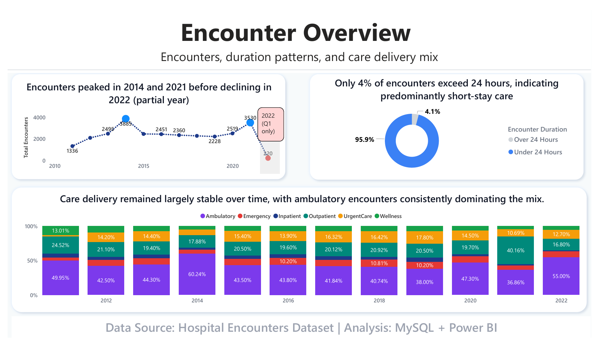
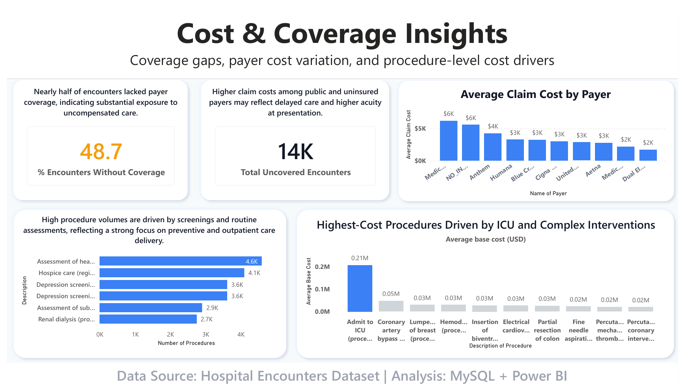
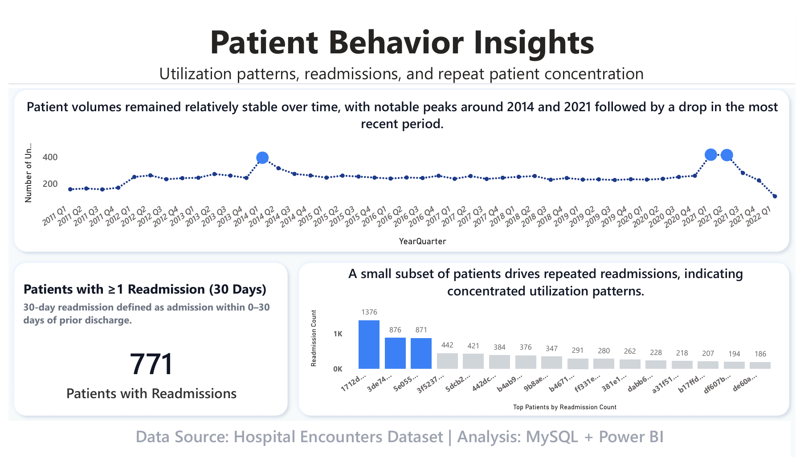

# hospital-encounters-analysis
Healthcare analytics case study using MySQL and Power BI to analyze hospital encounters, costs, and patient behavior.

# 🏥 Hospital Encounters Analysis
A healthcare analytics case study using MySQL and Power BI.

# Executive Summary

## 📊 Dashboards

### Encounter Overview

### Cost & Coverage Insights

### Patient Behavior Insights

# Results & Recommendations

## 💡 Skills Demonstrated
- SQL aggregation and filtering
+ Window functions (LEAD, DATEDIFF)
* Cohort analysis (30-day readmissions)
- Data transformation for BI
+ Power BI dashboard storytelling
* Healthcare data interpretation

## 📁 Repository Structure

/images
/sql

## 📌 Attribution
This project is based on a guided case study from Maven Analytics.  
SQL implementation, dashboard design, and extended analysis were completed independently.
