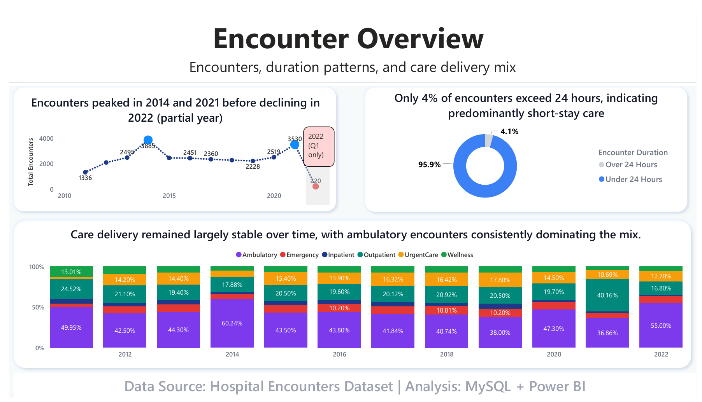
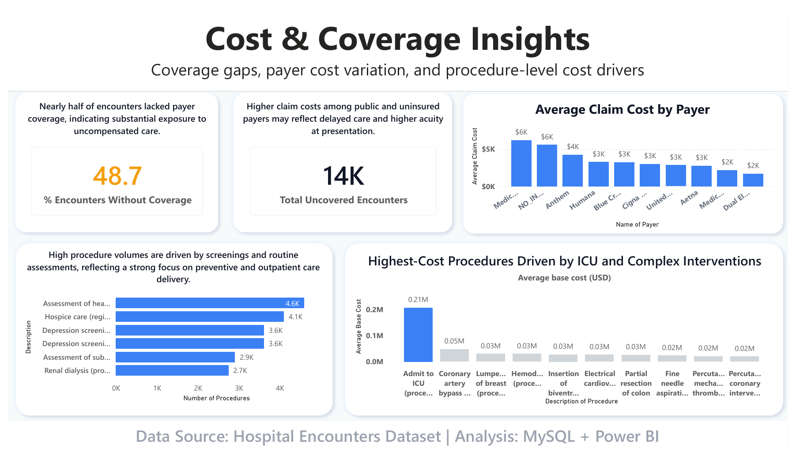
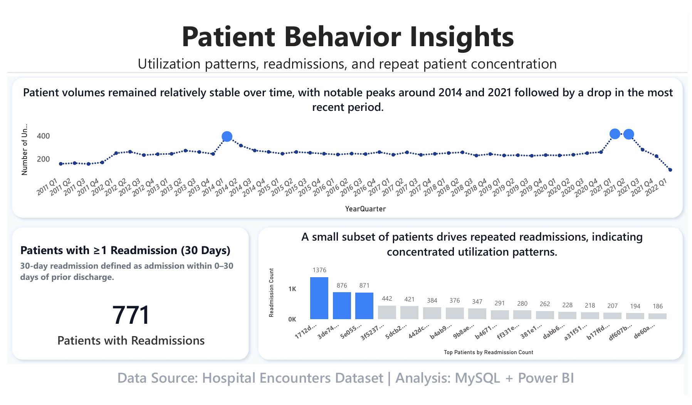

# hospital-encounters-analysis
A healthcare analytics case study exploring utilization, costs, and patient readmissions using MySQL and Power BI.


## 📌 Project Title

**Hospital Encounter Analytics: Trends, Costs, and Patient Behavior**  


  
An end-to-end healthcare analytics case study analyzing encounter trends, financial risk, and patient utilization patterns using MySQL and Power BI.

---

## 🎯 Key Findings

> **💰 49% of encounters had zero payer coverage** — significant uncompensated care risk requiring proactive financial screening

> **⚡ 95% of encounters lasted <24 hours** — high ambulatory volume presents opportunity to optimize short-stay pathways

> **📊 ICU-related procedures drive disproportionate costs** — small percentage of high-acuity cases account for majority of cost concentration

> **🔄 771 patients readmitted within 30 days** — concentrated among small high-frequency cohort, indicating need for targeted post-discharge care management

**→ Full analysis, dashboards, and recommendations below**

---

## 📚 Table of Contents

- [Project Title](#-project-title)
- [Key Findings](#-key-findings)
- [Dashboards](#-dashboards)
- [Executive Summary](#-executive-summary)
- [Business Recommendations](#-business-recommendations)
- [Methodology](#-methodology)
- [Skills Demonstrated](#-skills-demonstrated)
- [Limitations](#-limitations)
- [Next Steps](#-next-steps)
- [Author](#-author)


---

## 📊 Dashboards

### 🔹 Encounter Overview


**Insights**
- Encounter volume peaked in 2014 and 2021  
- Care delivery mix remained stable over time  
- Only a small proportion of encounters exceeded 24 hours  

---

### 🔹 Cost & Coverage Insights


**Insights**
- Nearly half of encounters lacked payer coverage  
- Preventive and routine procedures dominate volume  
- ICU-related and complex interventions drive cost concentration  

---

### 🔹 Patient Behavior Insights


**Insights**
- Patient volumes show cyclical patterns over time  
- 30-day readmission cohort identified  
- A small subset of patients drive repeated admissions  

---

## 📌 Executive Summary

Analyzed 15K+ hospital encounters to identify financial risk, utilization patterns, and cost drivers.

**Focus areas:** Encounter trends | Payer coverage gaps | Cost concentration | 30-day readmissions

**Tools:** MySQL (data analysis, cohort identification) | Power BI (executive dashboards)

**Outcome:** Actionable recommendations for optimizing ambulatory pathways, closing coverage gaps, and reducing high-frequency readmissions.

---


## 🛠 Methodology

**Data Analysis (MySQL):**
- Encounter aggregation by year, class, and procedure type
- 30-day readmission cohort identification using `LEAD()` window function
- Length-of-stay calculation with `TIMESTAMPDIFF()`
- Cost analysis and payer coverage assessment

→ [View complete SQL code](sql/hospital-encounters-analysis.sql)

**Visualization (Power BI):**
- 3 executive dashboards: Encounter Overview | Cost & Coverage Insights | Patient Behavior
- Consistent design hierarchy and executive-ready presentation
- DAX measures for dynamic metrics

**Data Transformation:**
- Created BI-ready aggregated views
- Standardized metric definitions (e.g., 30-day readmission logic)
- Structured outputs optimized for dashboard consumption

 
---

## 💡 Skills Demonstrated

**SQL:**
Aggregation, filtering, window functions (`LEAD`, `DATEDIFF`), cohort analysis, view creation

**Power BI:**
Executive dashboard design, DAX measures, data modeling, visual storytelling

**Healthcare Analytics:**
30-day readmission logic, utilization pattern analysis, cost driver identification, payer coverage analysis

**Business Communication:**
Translating clinical data into executive-ready insights and actionable recommendations 

---

## 📊 Business Recommendations

**1. Optimize Outpatient Capacity**
Finding: Encounter volumes peaked in 2014 and 2021; ambulatory care consistently dominates
→ Implement flexible staffing models to handle demand swings without resource waste

**2. Streamline Short-Stay Pathways**
Finding: 95% of encounters lasted <24 hours
→ Fast-track triage and discharge optimization to improve throughput and reduce cost per encounter

**3. Close Coverage Gaps at Intake**
Finding: 49% of encounters had zero payer coverage
→ Proactive financial screening and counseling to connect patients to Medicaid, charity care, or payment plans

**4. Monitor High-Acuity Cost Drivers**
Finding: ICU and complex interventions drove significantly higher average costs
→ Build cost-monitoring dashboards for high-acuity pathways; standardize escalation protocols

**5. Expand Early Intervention Programs**
Finding: Public and uninsured groups showed highest average claim costs
→ Community outreach targeting underinsured populations to reduce late-stage, high-cost admissions

**6. Target High-Frequency Utilizers**
Finding: 771 patients readmitted within 30 days, concentrated among small subset
→ Care management programs: follow-up calls, discharge planning, dedicated care coordinators

---

**Executive Takeaway:**
Targeted interventions in coverage gaps, short-stay workflows, and high-utilization segments can significantly improve care efficiency and financial resilience without requiring large structural changes.

---

## ⚠ Limitations

While the analysis provides strong directional insights, several limitations should be considered:

- The dataset is synthetic and may not fully represent real-world healthcare variability.  
- Absence of clinical severity indicators limits deeper risk stratification.  
- No demographic or socioeconomic segmentation was included in this iteration.  
- The analysis is cross-sectional and does not track long-term patient outcomes.

---

## 🚀 Next Steps
- Introduce star schema modeling for enhanced BI scalability  
- Expand into predictive modeling for readmission risk
- Add time-intelligence measures using a dedicated date dimension
- Conduct deeper segmentation of high-frequency utilizers


---


## 📁 Repository Structure

```
hospital-encounters-analysis/
│
├── images/
│   ├── encounter-overview.png
│   ├── cost-coverage-insights.png
│   └── patient-behavior-insights.png
│
├── sql/
│   └── hospital-encounters-analysis.sql
│
└── README.md
```


## 📌 Project Source & Attribution
This project is based on a guided case study from Maven Analytics.  
SQL implementation, dashboard design, and extended analysis were completed independently.


---

## 🧠 Author
**Deborah Akhabue**  
Healthcare Data Analyst  
MySQL | Power BI | Data Storytelling
